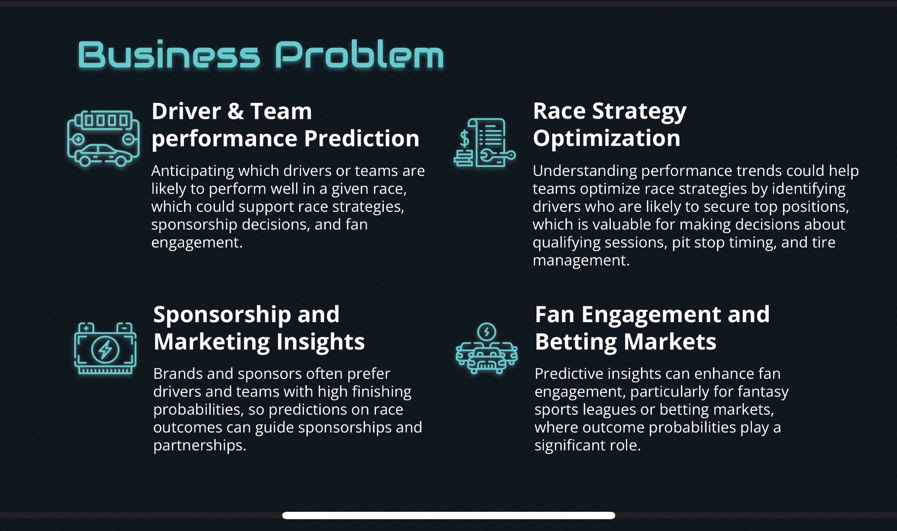
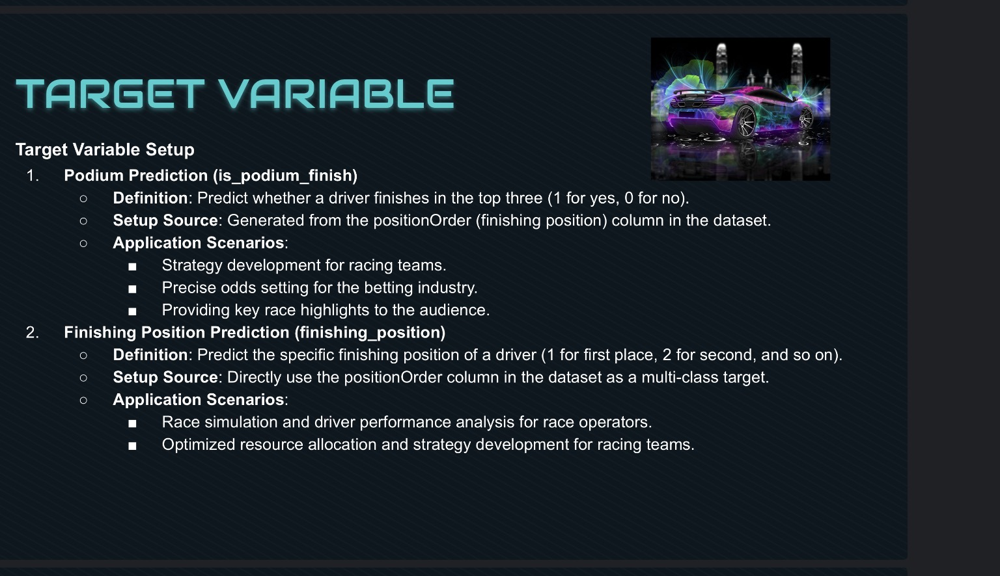
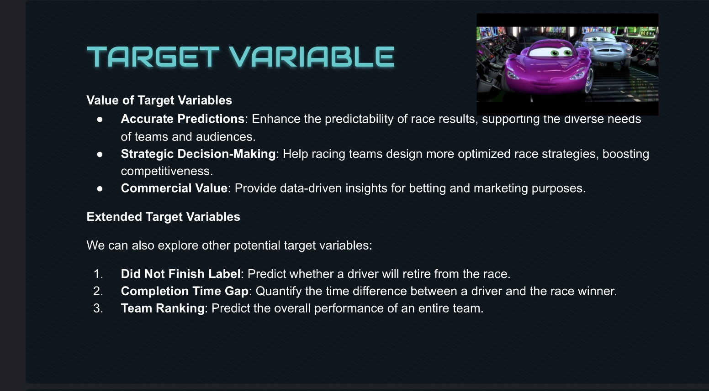
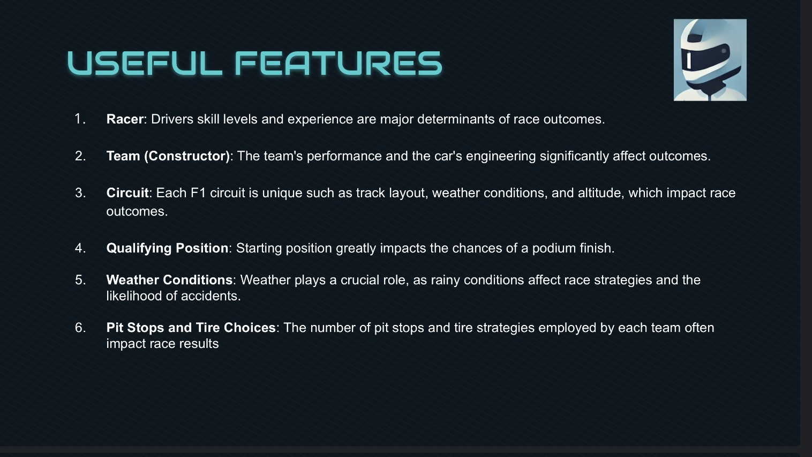
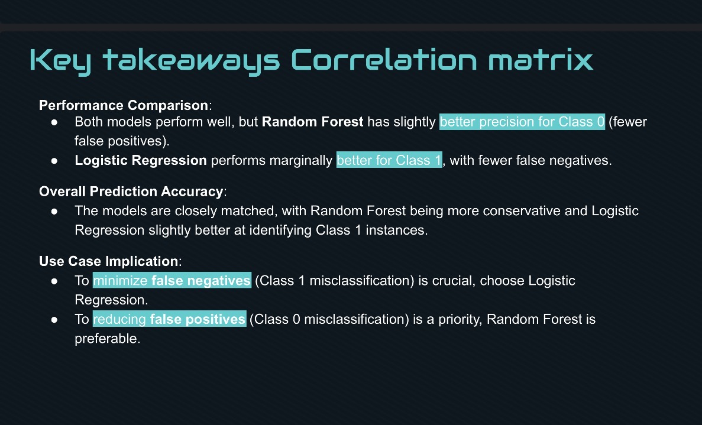
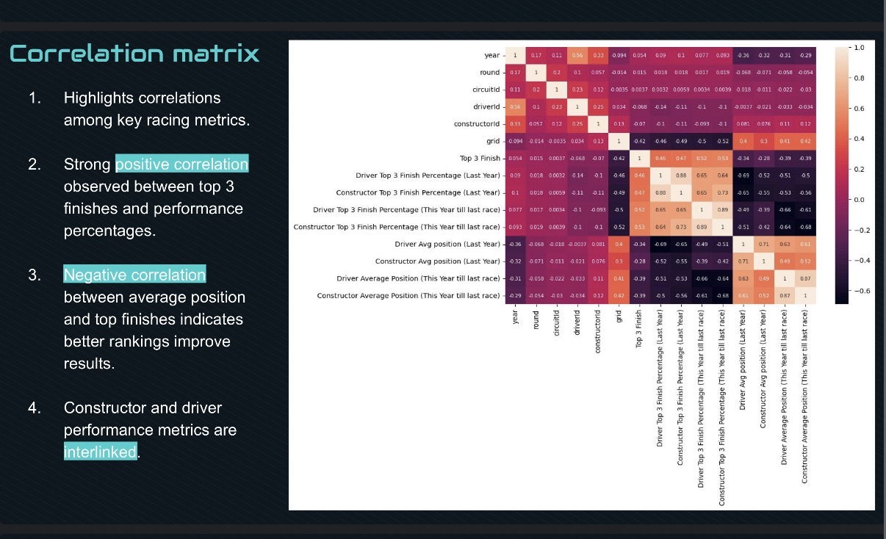
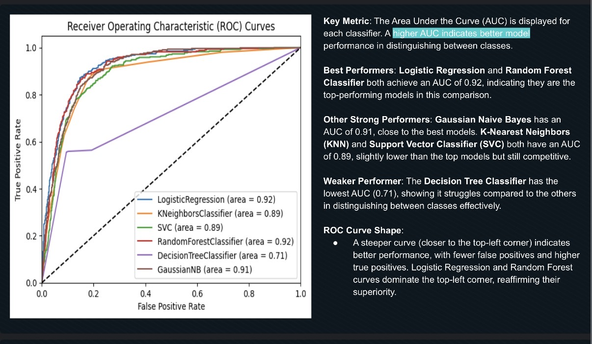

# Formula 1 Race Prediction (Podium Classification)

Built and benchmarked machine learning models to predict **podium outcomes (Top 3 finish)** in Formula 1 using historical race, driver, and constructor performance data. Compared multiple classifiers using ROC/AUC and summarized how predictions can support strategy, sponsorship decisions, and fan engagement.

## Business Objective
Predict podium probability before a race to help:
- **Race strategy**: assess likely podium contenders and risk scenarios
- **Sponsorship/marketing**: identify high-visibility drivers/teams
- **Fan engagement**: create data-driven pre-race content and storylines

## Problem Statement
Given historical race data and driver/team context, predict whether a driver will finish **Top 3** (podium) for an upcoming race.

## Data & Features
The project uses historical Formula 1 datasets and derives features such as:
- Driver/team performance indicators (form, results history)
- Race/circuit context (track characteristics where available)
- Other engineered predictors used to improve classification performance

(See visuals below for target definition, features, and correlation structure.)

## Modeling Approach
1. Cleaned data and prepared the target label (podium vs non-podium)
2. Performed feature engineering and exploratory analysis (correlation)
3. Trained and benchmarked multiple classification models:
   - Logistic Regression
   - Random Forest
   - Naive Bayes
   - KNN
   - SVC
   - Decision Tree
4. Evaluated models using **ROC curves and AUC** (and compared tradeoffs)

## Evaluation
Primary metric:
- **ROC / AUC** (to compare discrimination performance across models)

Key outcome:
- Best performance reported: **AUC = 0.92** (top-performing models included Logistic Regression and Random Forest)

## Key Findings (High-Level)
- Certain variables show stronger relationships with race outcomes (see correlation matrix)
- Model performance varies significantly by algorithm (ROC/AUC comparison)
- Different models may be preferred depending on business goal:
  - minimizing false negatives (missing podium contenders)
  - minimizing false positives (overpredicting podium)

## Key Visuals

## Files
- Report deck (PDF): [formula1_race_prediction.pdf](docs/formula1_race_prediction.pdf)

## Tools
Python, scikit-learn (models + evaluation), data preprocessing, ROC/AUC analysis, visualization

